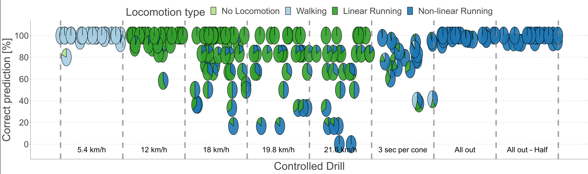

# ValidationOfFootballLocomotionCategories
Code for the validation of locomotion categories based on inertial measurement units

**Lentz-Nielsen, Nicki**., Madeleine, Pascal (2022), Validation of football locomotion categories derived from inertial measurements
*Under peer-review*

The code consist of four .r files. Two contains the main code (01 and 02) and two are functions.
 * **01-DataClearning.R** imports, cleans and maps the data to the correct participants.
 * **02-MappingDrills.R** Mapping the data to the correct date times of the executed drills.
 * **03-Statistics_and_visualisation.R** Calculates the %-agreement and creates visualisations such as confusion matrices and scatter-pie plots.
 * **cleanFMPdata.R:** Function used for to clean the provided football movement profile data
 * **extractAthleteName.R:** Function to secure correct mapping of the players for each data collection, a script was created to extract the names.
 * **PrettyConfusionMatrix.R** Function to create a pretty confusion matrix
 
## Abstract
In sports like football, knowledge concerning physical demands is used for training sessions and matches. 
Inertial measurement unit (IMU) are often used to estimate physical demands. Catapult Sports has recently developed, 
based on acceleration and gyroscope data, the Football Movement Profile (FMP) algorithm that enables to 
categorize physical demands into locomotion categories facilitating the interpretation of practitioners. 
The aim of this study was to assess the validity of FMP during controlled drills. Data was collected from 41 
elite youth football players executing controlled drills replicating linear locomotion at five velocities, 
i.e., 5.4, 12, 18, 19.8 and 21.6 km/h. and non-linear locomotion. An overall good agreement (> 95%) 
was found for lower velocity linear movements (≤ 12 km/h), but the agreement decreased with increasing velocities (74% at 21.6 km/h). 
A poor agreement was found for the lower velocity non-linear movements (76%) but increased with higher velocities (>98%). Classification errors
were also found to be related to players’ running style and size. Thus, it was recommended to create individual threshold values 
for the algorithm to increase the validity of the FMP algorithm.

### Data collection sketch
Sketch of the linear (A to E) and non-linear (F) drills used for locomotion data collection. Each linear
velocity was performed four times while the non-linear locomotion drill was executed three times. The first time
they passed a cone every 3 s; the second time they went all out; the third time they went all out but finished after
half of the circle.

### Scatterpieplot results 
Scatterplot where each dot is a pie plot illustrating the locomotion categorization distribution of a
single participant. The y-axis is the percentage of correct predictions relative to the drill, and the x-axis is the
drill performed, with vertical dashed lines to distinguish among the drills. The horizontal distribution of the pies
between each category line is a random jitter and is only for visualization purposes.

### Funding
The present study was partly supported and conducted under the Alliance for Sports Engineering
Educations and the Erasmus+ programme of the European Union.

### Data availability
Available upon reasonable request.
Raw GPS and IMU data was also collected during this study. 

### Acknowledgements
The authors thank the teachers and students from Danderyds Gymnasium (Sweden) for establishing and
facilitating contact with the players. The authors are also grateful to Chris Barnes (consultant for UEFA and
Catapult Sports), Paul Balsom (Swedish Football Federation) and Jérôme Durussel-Baker (Catapult Sports) for
their assistance in this study.
